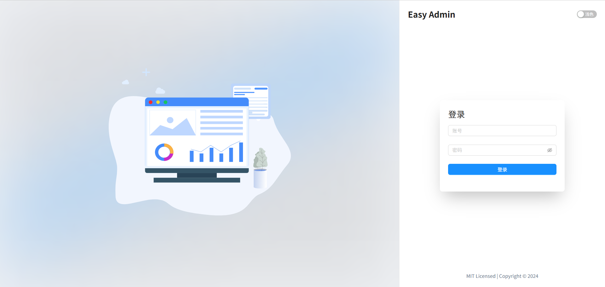

<div align="center">
  <h1>Easy Admin</h1>
</div>

## 简介

Easy Admin 是一个免费开源的中后台模板，它采用了 Vue3、Vite、JavaScript 等技术开发，开箱即用，适用于新手 vue 开发者和后端开发者，也适合学习参考。




## 克隆仓库使用

```bash
# 克隆仓库
git clone https://gitee.com/boss-zhijie/easy-admin.git
# 进入目录
cd easy-admin/app/web
# 安装依赖
npm install
# 运行
npm run dev
```

## 许可证

[MIT](./LICENSE)
